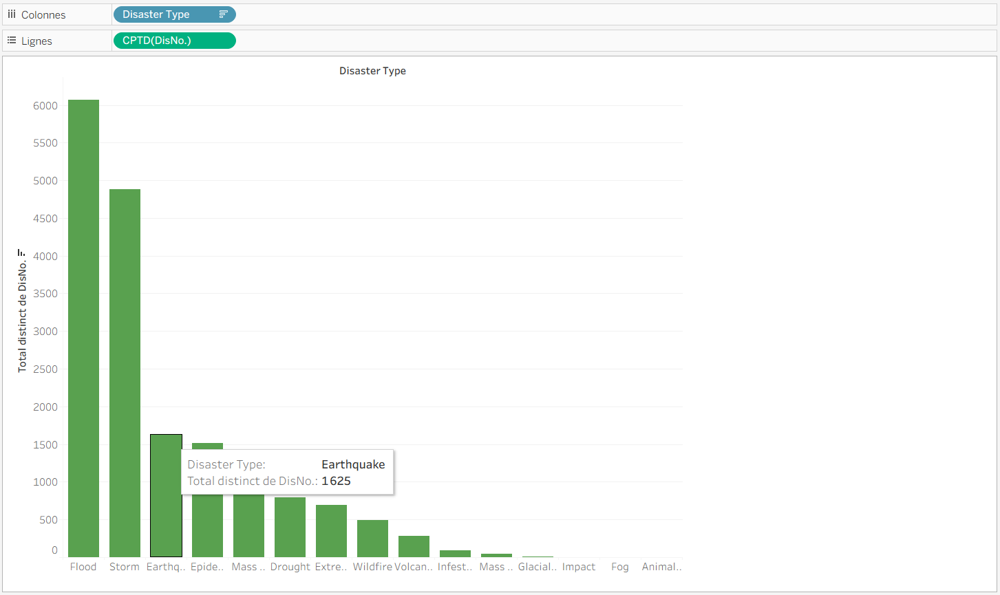
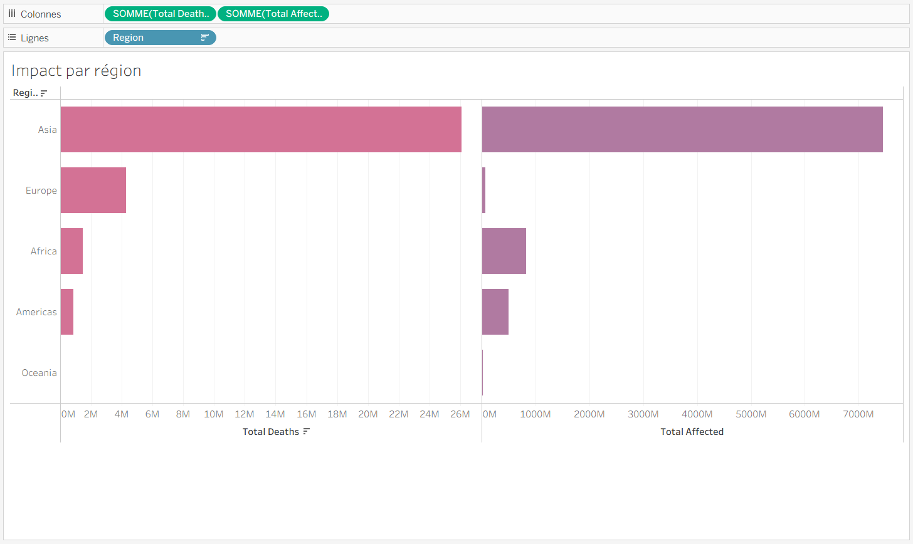
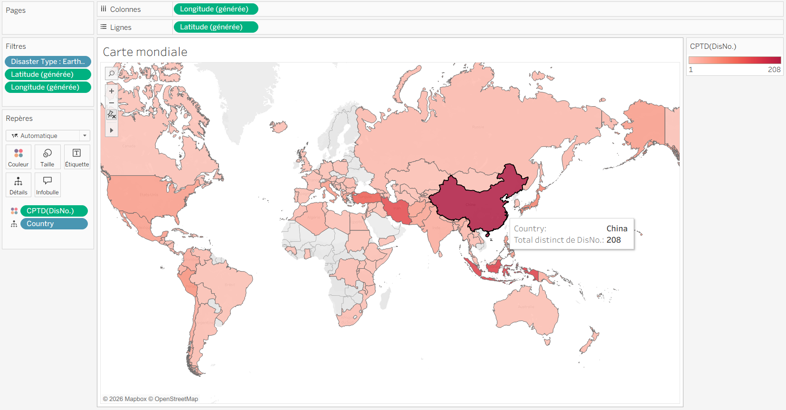
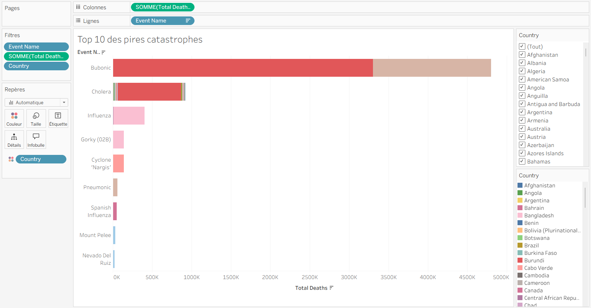
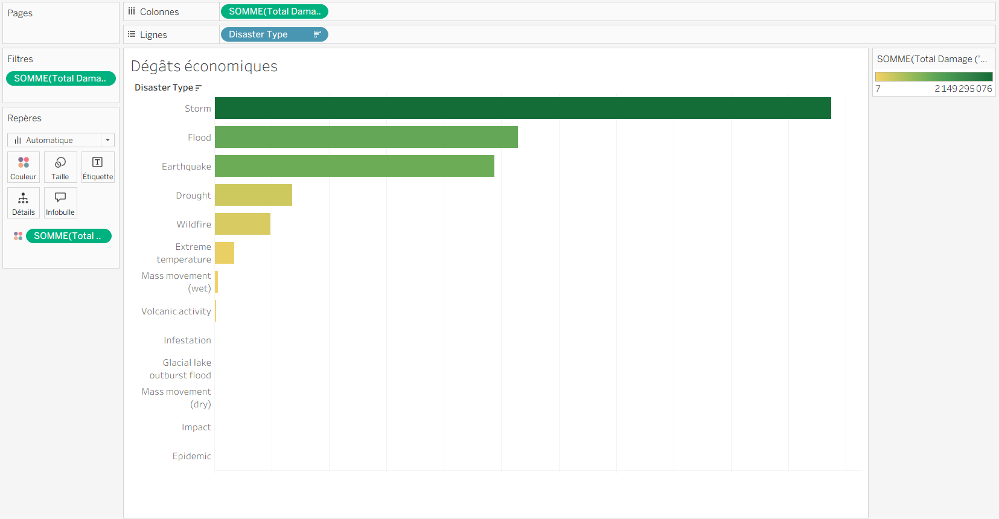
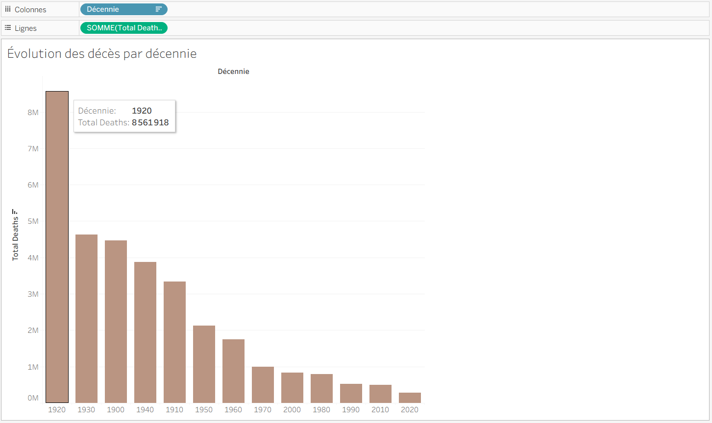
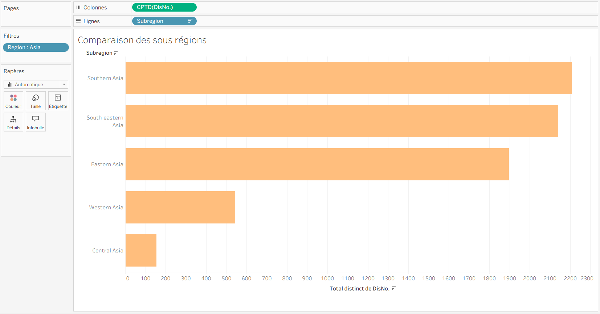
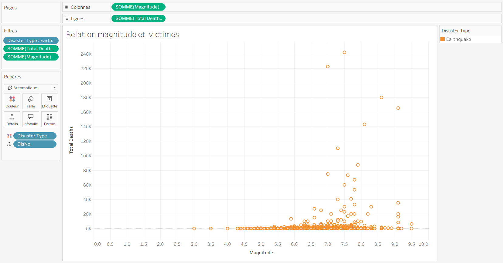

> Info : Ce TP est basé sur le dataset [EM-DAT](https://www.emdat.be/), qui recense les catastrophes naturelles à travers le monde. Vous pouvez télécharger le fichier Excel et l'importer dans Tableau.

 

 

- **_Lien de tableau Public :_** [https://public.tableau.com/app/profile/jeathusan.kugathas/viz/TP1_Catastrophes_Naturelles_Jeathusan_KUGATHAS_M1IBD_paris8/volutiondansletemps](https://public.tableau.com/app/profile/jeathusan.kugathas/viz/TP1_Catastrophes_Naturelles_Jeathusan_KUGATHAS_M1IBD_paris8/volutiondansletemps)

 
 

>- Outil de visualisation de données : **Tableau**

 

 
 

# **_Partie 4 — Premières visualisations_**

## Exercice 1 — Catastrophes par type

Créez une nouvelle feuille. Glissez **Colonnes**. Faites un clic droit sur **Disaster Type** vers **Lignes** et **DisNo.** vers **Disno.** dans **Colonnes** → **Mesure** → **Comptage (distinct)**. Triez par ordre décroissant.

**Questions :**

- **_Quel type de catastrophe revient le plus souvent ?_**
  - Le catastrophe qui revient souvant est inondation (Flood) avec un totale de 6066 mort.

   

  

    

- **_Combien de séismes sont enregistrés ?_**
  - Le séismes (earthquakes) est enregistrés une total de 1625 mort.

    

  

 
 

## Exercice 2 — Évolution dans le temps

Start Year vers Colonnes, comptage distinct). Vous avez une courbe. DisNo. vers Lignes (en Si vous voulez colorer par type de catastrophe, glissez
Couleur. Disaster Subgroup sur Couleur.

> **Question intéressante :** la courbe monte clairement au fil du temps. Est-ce qu'il y a vraiment plus de catastrophes, ou est-ce qu'on les enregistre juste mieux ?

- Oui, il y a vraiment plus de catastrophes depuis 1980, surtout hydrologiques et météorologiques (inondations et tempêtes). Avant 1980, c'était surtout qu'on les enregistrait mieux. Après 1980, l'augmentation est réelle à cause du changement climatique.

 

 
 

## Exercice 3 — Impact par région

**Region vers Lignes**

- Vous pouvez aussi ajouter **Total Deaths** vers Colonnes.
- Triez.
- **Total Affected** dans Colonnes pour comparer décès et personnes affectées.

> **Est-ce que c'est les mêmes régions qui ressortent ?**

- Les régions qui ressortent sont différentes pour les décès et les personnes affectées. Par exemple, l'Asie a un nombre élevé de personnes affectées, tandis que l'Asie a un nombre élevé de décès. Cela peut être dû à des facteurs tels que la densité de population, les infrastructures, et la préparation aux catastrophes.

 

 
 

## Exercice 4 — Carte mondiale

Nouvelle feuille, double-cliquez sur "automatiquement". Glissez `Country`. La tableau crée une carte avec `DisNo.` sur la couleur (comptage distinct) et vous pouvez changer la palette si vous le souhaitez (Couleur → Modifier les couleurs).

> **Essayez de filtrer sur un seul type** (par exemple : "Earthquake" dans Filtres). Cela correspond-il aux zones sismiques que nous connaissons ?

- En filtrant sur "Earthquake", la carte montre que les tremblements de terre se concentrent principalement autour de la Ceinture de feu du Pacifique (Japon, Indonésie, côte ouest des États-Unis, Chili) et dans certaines zones de collision continentale (Himalaya, Turquie, Iran).
La Chine apparaît en rouge foncé (208 séismes enregistrés) car elle chevauche plusieurs zones tectoniques actives, notamment à l'ouest avec l'Himalaya.

Conclusion : La distribution géographique des séismes reflète parfaitement la géologie de la planète et les limites des plaques tectoniques.

 

 
 

## Exercice 5 — Top 10 des pires catastrophes

Nouvelle feuille, glissez **Event Name** vers **Lignes**. Tableau va vous avertir qu'il y a trop de valeurs → "Filtrer puis ajouter".

Dans la fenêtre de filtre, onglet "Premiers", sélectionnez "Par champ" :

- Premiers → 10 → Total Deaths → Somme.
  Cliquez sur OK. Glissez Total Deaths vers Colonnes et faites venir ces catastrophes.

> **Triez. La numéro 1, c'est quoi ?**

- La catastrophe numéro 1 est "Bubonic" (la peste bubonique), avec environ 5 000 000 de décès. Les pays les plus touchés sont la Chine et l'Inde.

 

 
 

# **_Partie 5 — On va jouer !_**

Créez une ou deux visualisations selon ce qui vous intéresse. Quelques idées :

## Dégâts économiques

- Faites glisser **Disaster Type** vers _Lignes_
- Faites glisser **Total Damage ('000 US$)** vers _Colonnes_
- Triez par ordre décroissant (Optionnel)
- Faites glisser **Total Damage ('000 US$)** sur _Couleur_ pour un dégradé

 

 
 

## Évolution des décès par décennie

### Instructions pour l'analyse

1. **Créer une nouvelle feuille**
   - Menu : _Analyse_ → _Créer un champ calculé_
   - Nommez-le **Décennie** et entrez la formule correspondante.
   - Cliquez sur **OK**.

2. **Manipulation dans le volet Données**
   - Faites un clic droit, puis faites glisser.
   - Faites glisser **Décennie** vers la zone **Colonnes**.
   - Faites glisser **Total Deaths** vers la zone **Lignes**.

    

   

 
 

## Comparaison des sous-régions d'un continent

Faites glisser :

- **Region** vers **Filtres**
- Cochez un seul continent (ex : "Asia") → **OK**
- **Subregion** vers **Lignes**
- **DisNo.** vers **Colonnes** (comptage distinct)
- Triez par ordre décroissant

 

 
 

## Relation magnitude / victimes (scatter plot)

- Faites glisser **Magnitude** vers **Colonnes**
- Faites glisser **Total Deaths** vers **Lignes**
- Faites glisser **DisNo.** vers **Détail (carte des Repères)**
- Faites glisser **Disaster Type** vers **Couleur**

> _(Optionnel)_ Filtrez sur "Earthquake" pour isoler les séismes

 
 

